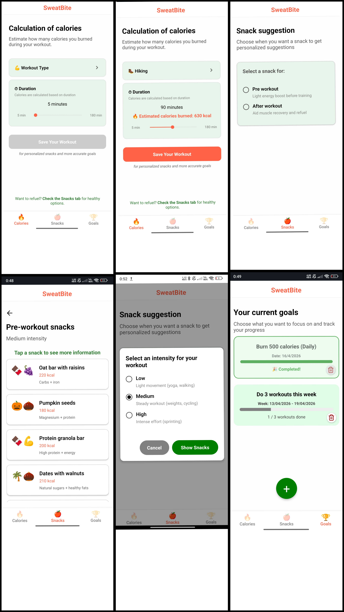
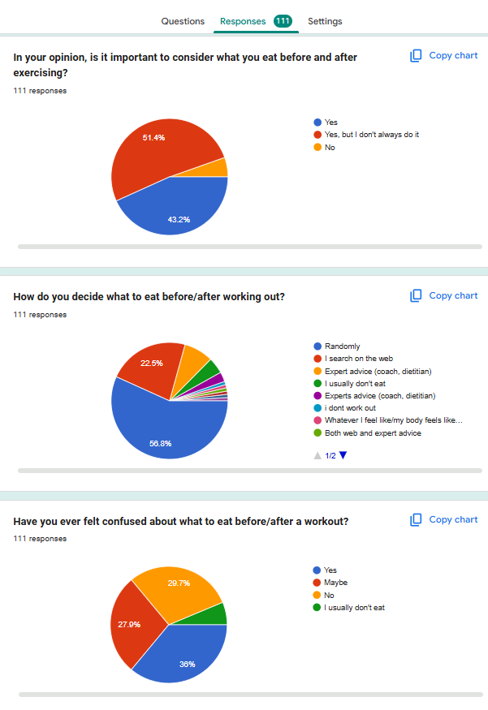
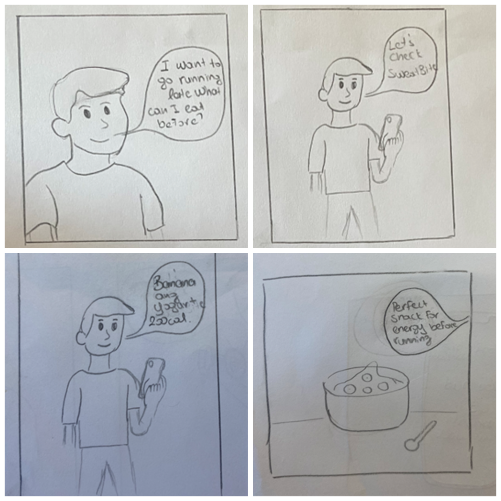
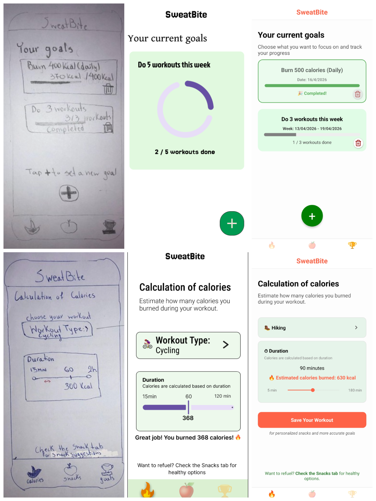

# 📱 SweatBite: Fitness & Nutrition Tracker

## 📌 Overview
**SweatBite** is a user-centric fitness and nutrition app built with **React Native**. It is designed to help users seamlessly calculate calories burned, monitor their progress, and receive intelligent snack suggestions. All data is securely saved locally on the user's device using `AsyncStorage`.

This project was developed as part of the **Human-Computer Interaction (HCI)** course during an Erasmus mobility program at **Sapienza University of Rome**.



---

## ✨ Key Features
* **Real-Time Calorie Calculation:** Dynamically see calories burned based on exercise duration and type.
* **Goal Setting & Tracking:** Set customizable fitness goals, such as target calories burned or a specific number of workouts per week.
* **Visual Progress Monitoring:** Intuitive visual goal monitoring keeps you motivated for each active goal.
* **Goal Management:** Easily add new goals or delete existing ones as your fitness routine evolves.
* **Smart Snack Suggestions:** Get tailored pre-workout and post-workout snack recommendations based on your exercise intensity and burned calories.

---

## 🏗️ The HCI & Design Process
SweatBite wasn't just coded; it was researched and designed using a strict **User-Centered Design (UCD)** methodology.

### 1. Need Finding & User Research
We conducted 17 in-depth interviews and gathered 111 survey responses to identify gaps in existing apps like MyFitnessPal and Apple Health. The data showed that users wanted simplicity, motivation, and help with snack choices without heavy data entry. We also created a Google Form survey to collect quantitative data on user preferences and pain points, which directly informed our design decisions.

> 📊 **User Research Data:** [View the SweatBite User Survey Responses](https://docs.google.com/forms/d/1y5B5mnkKyZPtvZk_QHWVtOARt8ZTguIUmHIE3DSsObA/edit)



### 2. Storyboarding & Prototyping
We visualized the user journey through detailed storyboards and transitioned from low-fidelity paper sketches to fully interactive Figma prototypes.

> 🎨 **Interactive Design:** [Explore the SweatBite Figma Prototype](https://www.figma.com/design/nysq3Z2V659sCltabF5myz/SweatBite?node-id=308-572&t=FKPcUFsJdnaSqNKe-1)



### 3. Iterative Design & Evaluation
We utilized the **"Think Aloud"** evaluation method with real users and performed **Cognitive Walkthroughs (CWGPT)**. Based on direct feedback, we made crucial UI adjustments, such as introducing real-time calorie calculations and making snack recommendation cards fully interactive.



---

## 📄 Documentation & Research Artifacts
For a deep dive into our UX research, survey data, and design iterations, please refer to the PDF documents in the `docs/` folder:

* **[HCI Implementation Report](./docs/SweatBite_HCI_Design_Report.pdf)**
* **[UX Evaluation Study](./docs/SweatBite_UX_Evaluation_Study.pdf)**
* **[User Research Data (Surveys & Interviews)](./docs/SweatBite_User_Research_Data.pdf)**
* **[Design Storyboards](./docs/SweatBite_Storyboards.pdf)**
* **[Paper Prototypes](./docs/SweatBite_Paper_Prototypes.pdf)**

---

## 🚀 How to Build and Run

**Prerequisites:**
* **Node.js** (which includes the `npm` package manager) installed on your machine.
* The **Expo Go** app installed on your iOS or Android mobile device.

**Installation & Execution Steps:**
1. Clone this repository and navigate to the `SweatBite` home directory.
2. Install the required dependencies by running:
   ```bash
   npm install
3. Start the application using Expo with a tunnel connection:
   ```bash
   npx expo start --tunnel -c
4. Open the Expo Go app on your phone, scan the QR code displayed in your terminal, and explore SweatBite!

## 👨‍💻 Creators

This project was created by the following team members:

* **Christina Maria Michailidou** 
* **Eleftheria Galiatsatou** 
* **Nikos Prevolis** 
* **Peter Kayiwa** 
* **Stefanos Tzaferis** 